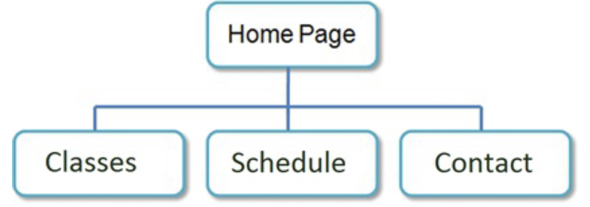
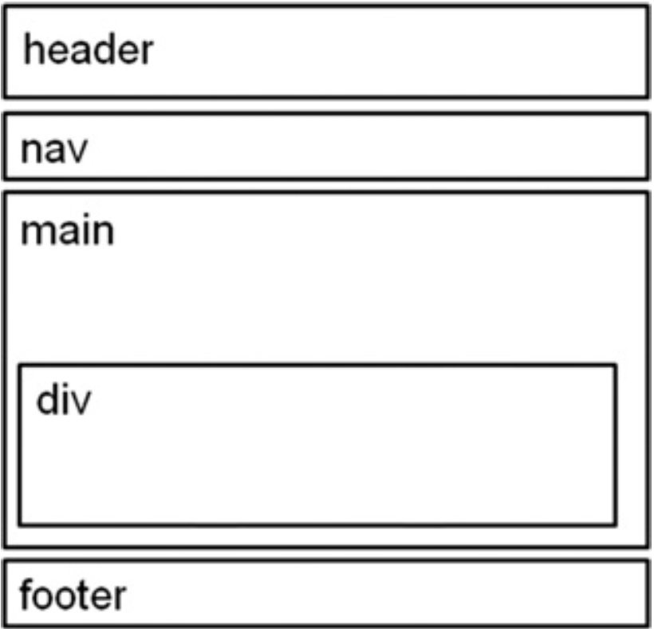

# WEBSITE CASE STUDY

## Path of Light Yoga Studio

Path of Light Yoga Studio is a small, recently opened yoga studio. The
owner, Ariana Starrweaver, would like a website to showcase her yoga studio
and provide information for both new and current students. Ariana would like
a:

- home page
- classes page that contains information about the types of yoga
  classes offered
- a schedule page
- contact page.

## Site Map

## Wireframe

# Completed tasks:

## Structuring the Website with HTML

1. Create a folder for the Path of Light Yoga Studio website.
2. Create the Home page: index.html.
3. Create the Classes page: classes.html.

## Result:

## Implementing CSS to embellish the website

1. Create an external style sheet that configures the
   color and text for the Path of Light Yoga Studio website.
2. Modify the Home page to utilize an external style sheet to configure
   colors and fonts
3. Modify the Services page to be consistent with the new Home page.
4. Configure centered page layout

## Result:
